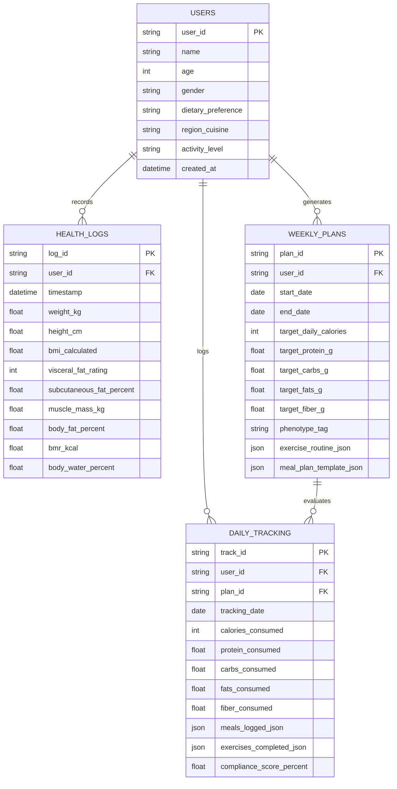
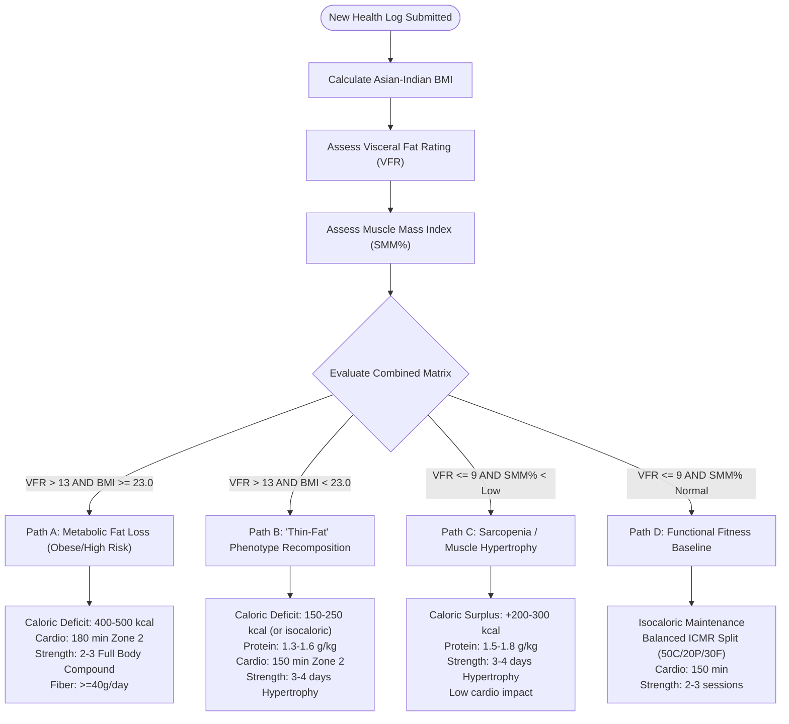

# System Architecture Document: Evidence-Based Indian Fitness & Nutrition Web Application

## 1. Architectural Overview & System Topology

The application is engineered as a **local-first, deterministic, client-side progressive web application (PWA)** with modular decoupled service layers. The architecture is designed around zero-hallucination principles: all biological computations, dietary plans, and exercise prescriptions are derived strictly from validated deterministic rule engines (ICMR-NIN 2024, WHO Asia-Pacific, and ACSM standards) rather than generative stochastic models.

```mermaid
graph TD
    subgraph UI_Layer ["Presentation & UI Layer (Responsive / Mobile-First)"]
        UI_Nav["Navigation & Header Component"]
        UI_Profile["User Profile & Smart Scale Ingestion"]
        UI_Dashboard["Analytics & Bio-impedance Dashboard"]
        UI_DietRec["Diet Recommendation Engine UI"]
        UI_ExerciseRec["Fitness & Workout Engine UI"]
        UI_Tracking["Daily Food & Workout Logger"]
        UI_Compliance["Plan Match & Compliance Scorecard"]
    end

    subgraph State_Layer ["Client State & Reactive Store Layer"]
        UserStore["User Store (Profiles & Preferences)"]
        HealthLogStore["Health Logs Store (Time-Series BIA)"]
        PlanStore["Weekly Plan Store (Diet & Workout)"]
        TrackStore["Daily Tracking Store (Logs & Adherence)"]
    end

    subgraph Engine_Layer ["Deterministic Scientific Engine Layer (Zero-Hallucination)"]
        BMIEngine["Asian-Indian BMI Classifier"]
        BIAEngine["Smart Scale Bio-impedance Diagnostic Engine"]
        PhenotypeEngine["Metabolic Phenotype Classifier ('Thin-Fat')"]
        CalorieEngine["Energy & TDEE Calculator (Katch-McArdle / ICMR)"]
        DietEngine["ICMR-NIN IFCT Regional Diet Planner"]
        WorkoutEngine["ACSM Progressive Overload Routine Planner"]
        ComplianceEngine["Adherence & Plan Matching Scoring Engine"]
    end

    subgraph Data_Layer ["Data & Storage Layer"]
        IndexedDB_Engine[("IndexedDB / LocalStorage Engine")]
        IFCT_DB[("ICMR-NIN IFCT Food Database (Local JSON)")]
        Exercise_DB[("ACSM Exercise Library (Local JSON)")]
        ExportImport["JSON Export / Import & Backup Sync"]
    end

    UI_Profile --> UserStore
    UI_Dashboard --> HealthLogStore
    UI_DietRec --> PlanStore
    UI_ExerciseRec --> PlanStore
    UI_Tracking --> TrackStore
    UI_Compliance --> TrackStore

    UserStore --> Engine_Layer
    HealthLogStore --> Engine_Layer
    Engine_Layer --> PlanStore
    Engine_Layer --> ComplianceEngine
    TrackStore --> ComplianceEngine

    UserStore <--> IndexedDB_Engine
    HealthLogStore <--> IndexedDB_Engine
    PlanStore <--> IndexedDB_Engine
    TrackStore <--> IndexedDB_Engine
    IFCT_DB --> DietEngine
    Exercise_DB --> WorkoutEngine
    IndexedDB_Engine <--> ExportImport
```



---

## 2. Demographic & Clinical Directives Compliance

The system strictly executes rules defined for the Indian demographic to prevent clinical mischaracterization:

### 2.1 Asian-Indian BMI Classification Engine
The engine overrides standard international cutoffs in favor of the consensus guidelines formulated by the Ministry of Health and Family Welfare (Govt. of India), ICMR, and WHO Western Pacific:

$$\text{BMI} = \frac{\text{Weight (kg)}}{[\text{Height (m)}]^2}$$

```typescript
export enum IndianBMICategory {
  UNDERWEIGHT = "Underweight",
  NORMAL = "Normal Weight",
  OVERWEIGHT = "Overweight",
  OBESE = "Obese"
}

export function classifyIndianBMI(bmi: number): {
  category: IndianBMICategory;
  riskProfile: string;
  colorHex: string;
} {
  if (bmi < 18.5) {
    return {
      category: IndianBMICategory.UNDERWEIGHT,
      riskProfile: "High risk for nutritional deficiency and sarcopenia",
      colorHex: "#3b82f6" // Blue
    };
  } else if (bmi <= 22.9) {
    return {
      category: IndianBMICategory.NORMAL,
      riskProfile: "Low to moderate cardiometabolic risk baseline",
      colorHex: "#10b981" // Green
    };
  } else if (bmi <= 24.9) {
    return {
      category: IndianBMICategory.OVERWEIGHT,
      riskProfile: "Elevated risk of insulin resistance, hypertriglyceridemia, and hypertension",
      colorHex: "#f59e0b" // Amber
    };
  } else {
    return {
      category: IndianBMICategory.OBESE,
      riskProfile: "Severe risk of Type 2 Diabetes, NAFLD, and premature Coronary Artery Disease",
      colorHex: "#ef4444" // Crimson
    };
  }
}
```

### 2.2 Dietary Formulation Standard (ICMR-NIN IFCT)
* **Nutritional Dataset**: Uses verified macro and micronutrient profiles from the **Indian Food Composition Tables (IFCT 2017/2024)** published by ICMR-NIN.
* **Regional Diets**: Supports 4 geographical archetypes:
  * **North Indian**: Wheat/phulka staple, whole pulses (Rajma, Dal Makhani without heavy butter, Chhole), curd/raita, paneer, mustard greens, seasonal gourds.
  * **South Indian**: Rice/Idli/Dosa with sambar (lentils + drumstick/vegetables), rasam, buttermilk, sundal (boiled legumes), fish curries.
  * **East Indian**: Rice and fish/egg staple, diverse leafy greens (shak), mustard oil base, chana dal, postor bora.
  * **West Indian**: Millets (Jowar, Bajra bhakri), Thepla/Khakhra (low oil), sprouted moth beans (Usal), peanut-curd combinations.
* **Dietary Splits**:
  * Lacto-Vegetarian (Paneer, curd, milk, legumes, soy, nuts)
  * Eggetarian (Includes whole eggs, egg whites)
  * Non-Vegetarian (Includes chicken, fish, mutton, eggs)
  * Vegan (Replaces dairy with soy milk, tofu, roasted chana, peanuts, sesame)
  * Jain (Strict vegetarian, strictly omitting onion, garlic, potatoes, root vegetables)
* **Foreign Ingredient Replacement Guardrail**:
  * Kale $\rightarrow$ Palak (Spinach) / Methi (Fenugreek leaves) / Sarson (Mustard leaves)
  * Quinoa $\rightarrow$ Foxtail Millet (Kangni) / Barnyard Millet (Sanwa) / Dalia (Broken wheat)
  * Chia Seeds $\rightarrow$ Sabja (Sweet basil seeds) / Flaxseeds (Alsi)
  * Avocado / Olive Oil $\rightarrow$ Cold-pressed Mustard Oil / Groundnut Oil / Sesame Oil / Controlled Desi Ghee

---

## 3. Core Data Entities & Schema Specifications

The data layer is modeled for local relational integrity with IndexedDB / JSON representations:



### 3.1 Entity Field Definitions

#### `Users`
```json
{
  "user_id": "usr_94b8e21a",
  "name": "Arjun Sharma",
  "age": 32,
  "gender": "male", // "male" | "female" | "other"
  "dietary_preference": "vegetarian", // "vegetarian" | "eggetarian" | "non_vegetarian" | "vegan" | "jain"
  "region_cuisine": "north_indian", // "north_indian" | "south_indian" | "east_indian" | "west_indian"
  "activity_level": "sedentary", // "sedentary" | "light" | "moderate" | "heavy"
  "created_at": "2026-09-13T10:00:00Z"
}
```

#### `Health_Logs`
```json
{
  "log_id": "hl_01f9a2",
  "user_id": "usr_94b8e21a",
  "timestamp": "2026-09-13T10:00:00Z",
  "weight_kg": 76.5,
  "height_cm": 172.0,
  "bmi_calculated": 25.86,
  "visceral_fat_rating": 14, // Scale 1 - 59 (>13 indicates high cardiometabolic risk)
  "subcutaneous_fat_percent": 21.4,
  "muscle_mass_kg": 29.8,
  "body_fat_percent": 27.2,
  "bmr_kcal": 1580,
  "body_water_percent": 51.5
}
```

#### `Weekly_Plans`
```json
{
  "plan_id": "wp_2026_w37",
  "user_id": "usr_94b8e21a",
  "start_date": "2026-09-14",
  "end_date": "2026-09-20",
  "phenotype_tag": "thin_fat_recomp",
  "target_daily_calories": 1850,
  "target_protein_g": 115,
  "target_carbs_g": 208,
  "target_fats_g": 61,
  "target_fiber_g": 38,
  "exercise_routine_json": {
    "weekly_goal": "3 Resistance Days + 150 min Zone 2 Cardio",
    "schedule": [
      { "day": "Monday", "focus": "Full Body Strength A", "exercises": [...] },
      { "day": "Tuesday", "focus": "Zone 2 Brisk Walk (45 min)", "exercises": [...] }
    ]
  },
  "meal_plan_template_json": {
    "breakfast": "Moong Dal Cheela with paneer stuffing + Green Chutney",
    "lunch": "2 Phulkas + 1 katori Tadka Dal + 1 katori Mix Veg Sabzi + Curd",
    "snack": "Roasted Chana / Sprouted Moong Chaat",
    "dinner": "Tofu/Paneer Bhurji with 1 Bajra Roti + Cucumber salad"
  }
}
```

#### `Daily_Tracking`
```json
{
  "track_id": "dt_2026_09_14",
  "user_id": "usr_94b8e21a",
  "plan_id": "wp_2026_w37",
  "date": "2026-09-14",
  "calories_consumed": 1820,
  "protein_consumed": 112,
  "carbs_consumed": 205,
  "fats_consumed": 60,
  "fiber_consumed": 36,
  "meals_logged_json": [
    { "item_id": "ifct_dal_tadka", "name": "Dal Tadka", "quantity": "1 katori (150g)", "calories": 180, "protein": 9.2 }
  ],
  "exercises_completed_json": [
    { "exercise_id": "sq_bodyweight", "name": "Bodyweight Squat", "sets_completed": 3, "reps_completed": 12 }
  ],
  "compliance_score_percent": 94.2
}
```

---

## 4. Algorithmic Processing Logic & Scientific Rule Matrix

### 4.1 Phenotype Identification & Goal Derivation Matrix

When a user submits health metrics, the engine parses bio-impedance parameters against age/gender norms:



### 4.2 Energy & Macronutrient Calculation Algorithm
1. **Basal Metabolic Rate (BMR)**:
   * When Lean Body Mass (LBM) is provided by smart scale:
     $$\text{LBM} = \text{Weight (kg)} \times \left(1 - \frac{\text{Body Fat } \%}{100}\right)$$
     $$\text{BMR} = 370 + (21.6 \times \text{LBM})$$
   * Fallback via Mifflin-St Jeor:
     $$\text{Men: } \text{BMR} = (10 \times W) + (6.25 \times H) - (5 \times A) + 5$$
     $$\text{Women: } \text{BMR} = (10 \times W) + (6.25 \times H) - (5 \times A) - 161$$
2. **Total Daily Energy Expenditure (TDEE)**:
   $$\text{TDEE} = \text{BMR} \times \text{Physical Activity Level (PAL)}$$
   * Sedentary: 1.2 | Light Active: 1.375 | Moderately Active: 1.55 | Heavy: 1.725
3. **Calorie Target Guardrails**:
   * Minimum Floor: $\ge 1400\text{ kcal}$ for adult men, $\ge 1200\text{ kcal}$ for adult women. Under no circumstances will the system output crash diets.
4. **Macronutrient Split Algorithm**:
   * **Protein**: Derived directly from target body weight and training stimulus ($1.0 - 1.6\text{ g/kg}$).
   * **Fats**: 25–30% of total caloric intake ($1\text{ g fat} = 9\text{ kcal}$).
   * **Carbohydrates**: Remaining calories divided by 4 ($1\text{ g carb} = 4\text{ kcal}$).
   * **Dietary Fiber**: $35 - 45\text{ g/day}$ to assist in blunting post-prandial glycemic spikes and visceral fat mobilization.

### 4.3 Daily Compliance & Plan Matching Algorithm
The application evaluates daily adherence using a normalized multi-criteria objective function:

$$\text{Compliance Score} = (w_1 \cdot C_{\text{cal}}) + (w_2 \cdot C_{\text{protein}}) + (w_3 \cdot C_{\text{workout}}) + (w_4 \cdot C_{\text{fiber}})$$

Where:
* $w_1 = 0.35$ (Caloric Target Accuracy)
  $$C_{\text{cal}} = \max\left(0, 100 - \frac{|\text{Actual Cal} - \text{Target Cal}|}{\text{Target Cal}} \times 100\right)$$
* $w_2 = 0.35$ (Protein Floor Match)
  $$C_{\text{protein}} = \min\left(100, \frac{\text{Actual Protein (g)}}{\text{Target Protein (g)}} \times 100\right)$$
* $w_3 = 0.20$ (Workout Execution Match)
  $$C_{\text{workout}} = \frac{\text{Completed Exercises / Minutes}}{\text{Prescribed Exercises / Minutes}} \times 100$$
* $w_4 = 0.10$ (Fiber & Hydration Floor)
  $$C_{\text{fiber}} = \min\left(100, \frac{\text{Actual Fiber (g)}}{\text{Target Fiber (g)}} \times 100\right)$$

---

## 5. Frontend Architecture & Design System

The user interface is designed for high aesthetic impact, speed, and zero cognitive load:

### 5.1 Design Tokens & Aesthetics
* **Theme**: Deep modern dark mode default (`#0B0F19` background) with high-contrast emerald (`#10B981`) for health/compliance, electric cyan (`#06B6D4`) for hydration/movement, and warm amber (`#F59E0B`) for warnings.
* **Surface Glassmorphism**: `backdrop-filter: blur(12px)` with subtle border strokes (`rgba(255, 255, 255, 0.08)`).
* **Typography**: Outfit / Inter variable font hierarchy for readability of clinical statistics.
* **Visual Data Elements**:
  * SVG Circular Progress Gauges (Compliance Score & Macros).
  * Color-coded Asian-Indian BMI spectrum badge.
  * Bio-impedance radar / bar distribution for Visceral vs. Subcutaneous fat.

### 5.2 Application Modules & Routing
1. **`/profile`**: Anthropometric onboarding & smart scale BIA data entry.
2. **`/dashboard`**: Indian BMI classification, visceral fat risk meter, muscle mass trends.
3. **`/plan`**: Dynamic weekly meal cards (breakfast, lunch, snack, dinner) + day-by-day workout prescription.
4. **`/tracking`**: Quick-log food calculator with Indian portion units (katoris, phulkas, pieces) + workout checklist.
5. **`/analytics`**: Multi-week compliance curves and weight recomposition trajectory.

---

## 6. Persistence & Offline-First Strategy

1. **Storage Mechanism**: Client-side **IndexedDB** using an asynchronous promise-based wrapper, with automatic synchronization to `localStorage` for fast session recovery.
2. **Export / Import**: One-click encrypted JSON backup and restore, allowing users to move their health logs across browsers without requiring third-party cloud accounts.
3. **PWA Capabilities**: Service worker caching of app shell, ICMR-NIN food dataset, and exercise video/illustration assets for 100% offline usability.

---

## 7. Security, Privacy & Medical Guardrails

1. **Client-Side Data Privacy**: Sensitive biometric data (weight, visceral fat, age, gender) remains stored locally on the user's device by default.
2. **Clinical Disclaimers**: Every screen displaying recommendations explicitly renders:
   > *"Notice: This tool provides general fitness and lifestyle recommendations based on ICMR-NIN and ACSM guidelines. It does not provide medical diagnosis, treatment, or clinical intervention. Consult a physician before beginning any strenuous workout regimen."*
3. **Extreme Anomaly Trapping**: Input validation guards against invalid bio-impedance entries (e.g., negative fat percentages, visceral fat > 59, or caloric restrictions below physiological safety limits).
